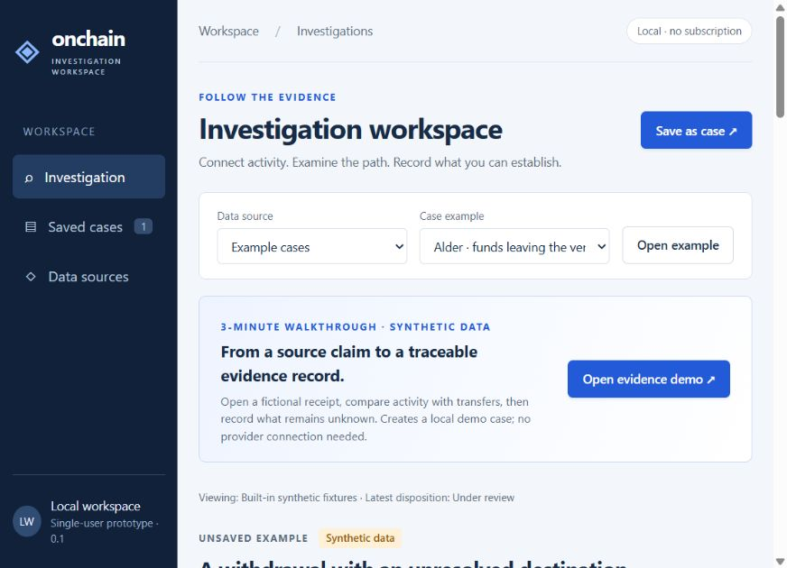
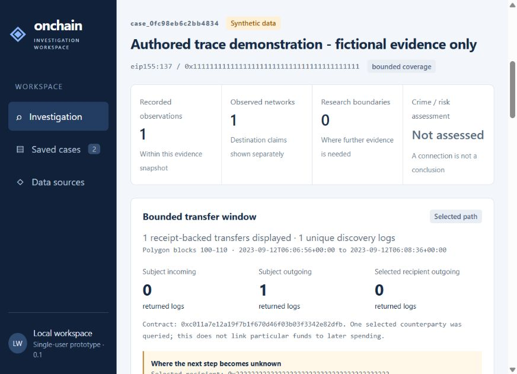
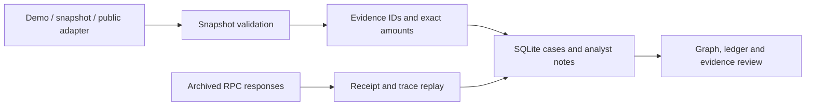

# Onchain Investigation Workspace

[](https://github.com/DenizErginGunduz/onchain-investigation-workspace/actions/workflows/tests.yml)

### Follow the evidence. Explain the settlement. Preserve the unknowns.

A local investigation workbench for reviewing crypto activity, replaying Polygon receipt evidence, and documenting analyst conclusions. Built for a reproducible investigation workflow, with an experimental Polymarket adapter and replaceable data providers.

**Python standard library · SQLite · Vanilla JavaScript · No API key needed for the demo**



*Actual application screenshot. Public examples are fictional and clearly labeled. Automated AML, fraud and insider detection are not implemented.*

## Try it in three minutes

Requires Python 3.12+ and a modern browser. No dependency installation is required.

```sh
python server.py
```

Open **http://127.0.0.1:8765/** and click **Open evidence demo**. This creates a local synthetic case, validates its archived records and replays its selected receipt without contacting an external provider.

1. Read **Bounded transfer window**: one selected transfer, one asset, an explicit block range.
2. Inspect **Receipt & settlement review**: execution is supported within the fixture; finality and settlement interpretation remain unresolved.
3. Switch **Evidence layer** between source activity and receipt-backed transfers. A provider assertion is not a token transfer.
4. Add an **Analyst record**, then reopen the case from **Saved cases**.

The large raw integer is deliberate precision-test data, not observed economic volume. For the broader graph workflow, select **Example cases → Alder**.

## What this demonstrates

| Analyst question | Working capability | Evidence boundary |
| --- | --- | --- |
| What actually moved? | Exact integer amounts, chain/transaction/log identity and selected receipt checks | Partial coverage; no full wallet accounting |
| Does the source claim agree? | Separate provider and receipt layers; narrow purchase/fee interpretation | The bundled trace fixture has no supported purchase |
| Can a reviewer reproduce it? | Archived bodies, digests, request-role checks and offline recomputation | Integrity is not source authenticity |
| Where does the trail stop? | Fixed-window collateral discovery and recipient-continuation state | No verified second hop or common-owner inference |
| What did the analyst decide? | SQLite cases, append-only notes and dispositions | Local single-user workflow |



## Architecture



Provider calls run on the local Python host. The browser uses the application's API. Cases and evidence identities belong to the application; replacing a provider does not promise equivalent coverage or data rights.

[Architecture](ARCHITECTURE.md) · [Evidence contract](EVIDENCE_CONTRACT.md) · [Capability status](docs/CAPABILITIES.md)

## Verify

```sh
python -m unittest discover -s tests -v
```

The **58-test suite** covers exact amounts, identity, source failures, atomic import, receipt/block consistency, trace boundaries, persistence and export guards. These are software checks, not financial-crime detection accuracy. [Validation record](docs/VALIDATION.md).

## Scope and distribution

The host binds to loopback and must not be exposed on the internet. No complete wallet history, sanctions screening, service registry, calibrated risk score, clustering, skill ranking, ML or multi-user authentication is included.

The demo is offline. Optional collection modules require reachable sources and applicable rights; failures do not silently substitute fictional data. No real-case archive, credentials, database, operational Git history or Actions artifact is distributed. Cases are stored under ignored `.runtime/`.

Source is available for inspection. No open-source license has been selected; do not assume permissive reuse rights. Provider data requires its own rights assessment.

The next research gate is a proposed stratified API-versus-chain comparison. Detector performance and commercial readiness have not been established.
